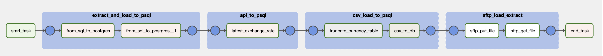
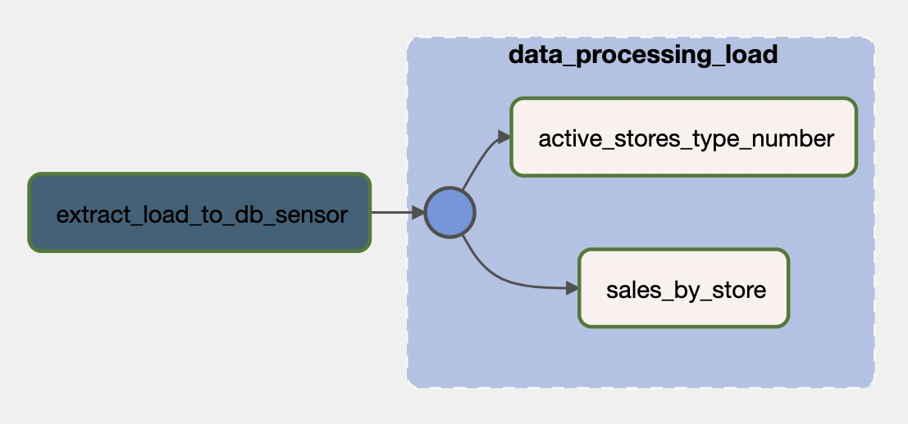

## ETL with Airflow
In this example we have created data pipelines with Apache Airflow. We have used different Airflow operators and sensors to extract, transform and load data. Here is the list of Hooks, Operators and Sensors we have used:
 + PythonOperator
 + BashOperator
 + SFTPOperator
 + PostgresOperator
 + DummyOperator
 + ExternalTaskSensor
 + BaseHook
 + MsSqlHook
 
 
We have used ContosRetailDW database which has been restored to SQL Server, API Exchange Rate data from https://openexchangerates.org, CSV file and Azure Blob Storage as SFTP Server. Data has been extracted, transformed and loaded to Postgres database. We have created 2 dags which will be explained below. To keep it clean and secured we did few steps: 
 + keep [functions](dags/includes/db_etl/functions.py) in separate script
 + keep credentials in Airflow Variables and Connections
 + use [TaskGroup](dags/extract_load_to_db.py) to organize tasks
 + use [ExternalTaskSensor](dags/process_load_to_db.py) to start next dag
 
 ### 1. [ETL](dags/extract_load_to_db.py)
 
 
 This dag containes extracting, transforming and loading data to Postgres DB:
  + Extract data from SQL Server and load it to Postgres
  + Fetch data with API and store it to Postgres
  + Store data from CSV file into Postgres
  + PUT and GET file from SFTP Server
 
 ### 2. [External Task Sensor and Processing](dags/process_load_to_db.py)
 
 
  + Use ExternalTaskSensor to listen for previous dag to finish sucesscully
  + Extract data from SQL Server and Postgres
  + Merge and process data
  + Load data to Postgres
