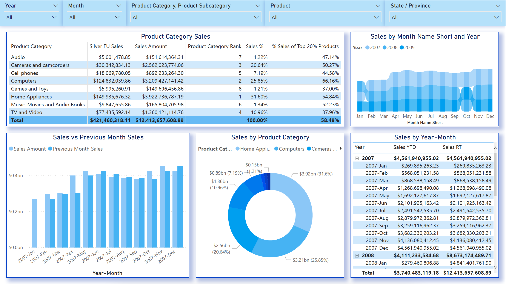

# Power BI - DAX
Here is the DAX Query used in our Power BI example:

#### Create Calendar with DAX
```
Calendar = 
VAR StartDate = DATE(YEAR(MIN(FactSales[DateKey])),1,1)
VAR EndDate = DATE(YEAR(MAX(FactSales[DateKey])),12,31)
VAR StartOfFiscalYear = 11
RETURN
    ADDCOLUMNS(
        CALENDAR(StartDate, EndDate),
    "Year",YEAR([Date]),
    "Month",MONTH([Date]),
    "Days in Month",DATEDIFF(DATE( YEAR([Date]), MONTH([Date]), 1),EOMONTH([Date],0),DAY)+1,
    "Year Month Number",INT(FORMAT([Date],"YYYYMM")),
    "Year Month Name",FORMAT([Date],"YYYY-MMM"),
    "Day",DAY([Date]),
    "Day Name",FORMAT([Date],"DDDD"),
    "Day Name Short",FORMAT([Date],"DDD"),
    "Day of Week",WEEKDAY([Date]),
    "Day of Year",DATEDIFF(DATE( YEAR([Date]), 1, 1),[Date],DAY)+1,
    "Month Name",FORMAT([Date],"MMMM"),
    "Month Name Short",FORMAT([Date],"MMM"),
    "Quarter",QUARTER([Date]),
    "Quarter Name","Q"&FORMAT([Date],"Q"),
    "Year Quarter Number",INT(FORMAT([Date],"YYYYQ")),
    "Year Quarter Name",FORMAT([Date],"YYYY")&" Q"&FORMAT([Date],"Q"),
    "Week of Year",WEEKNUM([Date]),
    "Fiscal Year",if(StartOfFiscalYear=1,YEAR([Date]),YEAR([Date])+ QUOTIENT(MONTH([Date])+ (13-StartOfFiscalYear),13)),
    "Fiscal Quarter",QUARTER( DATE( YEAR([Date]),MOD( MONTH([Date])+ (13-StartOfFiscalYear) -1 ,12) +1,1) ),
    "Fiscal Month",MOD( MONTH([Date])+ (13-StartOfFiscalYear) -1 ,12) +1
    )
```

#### SUM Measure
```
Sales Amount = SUM(FactSales[SalesAmount])
```

#### Calculate function with filter
```
Silver Europe Sales = 
CALCULATE(
    FactSales[Sales Amount],
    DimProduct[ColorName] = "Silver",
    DimGeography[ContinentName] = "Europe"
)
```

#### Ranking by Sales Amount
```
Product Category Rank = 
IF(
    ISINSCOPE(DimProductCategory[ProductCategoryName]),
    RANKX(
        ALLSELECTED(DimProductCategory[ProductCategoryName]),
        FactSales[Sales Amount]
    )
)
```

#### Percentage in Total Sales
```
Sales % = 
DIVIDE(
    FactSales[Sales Amount],
    CALCULATE(
        FactSales[Sales Amount],
        ALLSELECTED(DimProductCategory[ProductCategoryName])
    )
)
```

#### Using Variables to Calculate % Sales of Top 20% Products
```
% Sales of Top 20% Products = 
VAR Products20Percent = DISTINCTCOUNT(FactSales[ProductKey]) * 0.2
VAR SalesOfTop20Products = 
    CALCULATE(
        FactSales[Sales Amount],
        FILTER(
            VALUES(FactSales[ProductKey]),
            RANKX(
                VALUES(FactSales[ProductKey]), 
                FactSales[Sales Amount],,DESC
                ) < Products20Percent
            )
        )

VAR Result = DIVIDE(
                SalesOfTop20Products,
                FactSales[Sales Amount]
            )

RETURN
    Result
```

#### CALCULATE and DATEADD to get values for previous month
```
Previous Month Sales = 
CALCULATE(
    [Sales Amount],
    DATEADD('Calendar'[Date],-1,MONTH)
)
```

#### Year to Date Sales
```
Sales YTD = 
CALCULATE (
    [Sales Amount],
    DATESYTD( 'Calendar'[Date] )
)
```

#### Running Total Sales
```
Sales RT = 
VAR MaxDate = MAX('Calendar'[Date])
RETURN
    CALCULATE (
        [Sales Amount],
        'Calendar'[Date] <= MaxDate,
        ALL('Calendar'[Date])
    )
```

# Power BI - Dashboard


