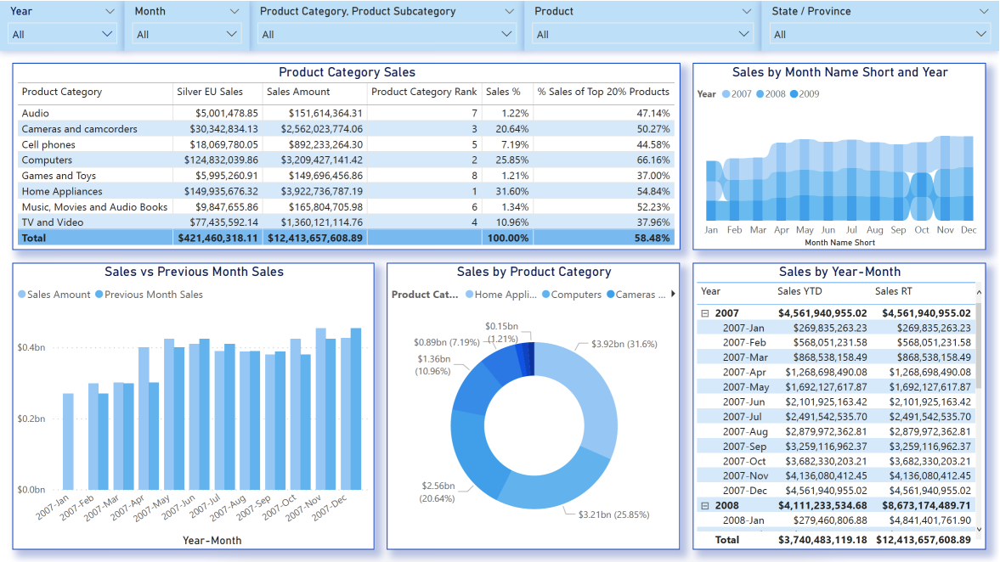

# Data Engineering - ETL, Apache Airflow and Kafka, SQL, Data Analysis and Data Visualization

### Built with

+ Apache Airflow
  + Docker

+ Apache Kafka

+ Python
  + Pandas
  + matplotlib
  + seaborn
  + psycopg2
  + requests
  + sqlalchemy
  + dotenv
  + Tools:
    + VSCode
    + Jupyter Notebook

+ SQL
	+ SQL Server
	+ PostgreSQL
  + Tools:
	  + Azure Data Studio
	  + Dbeaver

+ Cloud
  + Azure
    + Azure Functions 
  + AWS
    + Lambda
    + API Gateway

+ Power BI
  + DAX
  + M

## [SQL](/BD)
Here we have used Docker to run SQL Server on Mac and ContosoRetailDW as database. We have created [ER Diagram](/DB/ER%20Diagram/) with draw.io, and written [SQL Query](/DB/SQL%20Query/) with CTE, JOINS, Triggers, Procedures, Variables etc., and have [analyzed data with Python](/DB/Analytics/Python/): 
+ [SQL Query](/DB/SQL%20Query/)
+ [ER Diagram](/DB/ER%20Diagram/)
+ [Docker - SQL Server on Mac](/DB/Docker/)
+ [data analysis and data visualization](/DB/Analytics/Python/) with Python.

## [Data Visualization with Power BI](/PowerBI)
In this example we have used data from ContosoRetailDW database were we have created multiple [DAX queries](/PowerBI/DAX.txt) and [Dashboard](PowerBI/Dashboard.png). To get data we have connected directly to SQL Server.

## [Python Data Analysis](/DB/Analytics/Python/)
In this example we have showed how to connect to SQL Server with [Python, analyze and visualize data](DB/Analytics/Python/). Here is the list of libraires we have used:
 + pandas
 + numpy
 + seaborn
 + matplotlib
 + sqlalchemy
 + dotenv
